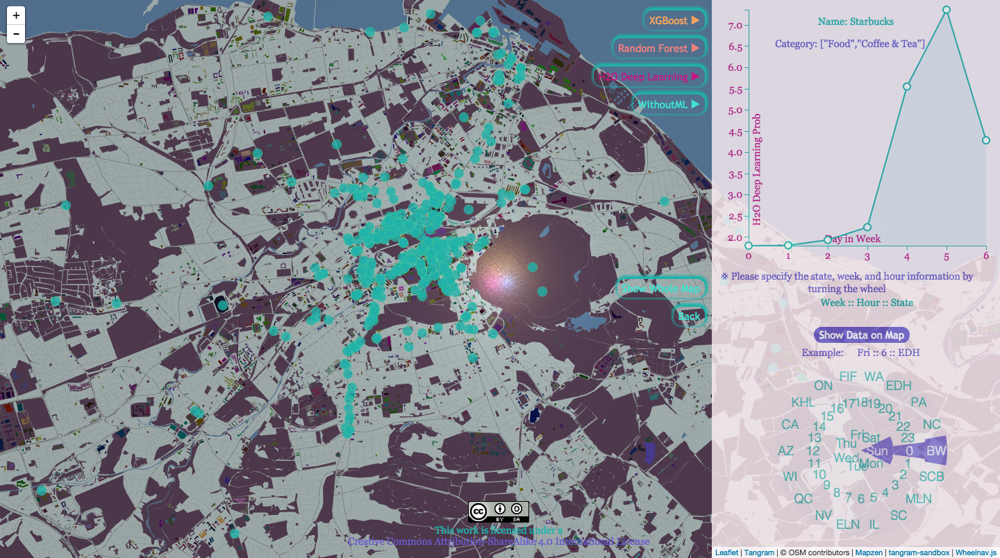

* Demo: [https://data-map.herokuapp.com](https://data-map.herokuapp.com)      
       
  

### Check List:
* Machine Learning Algorithms
  * XGBoost
  * Random Forest
  * Deep Learning (H2O)
* [Cascading](cascading-yelpdataset)
  * Cascading Pattern 
  * Driven
  * [AWS EMR](cascading-yelpdataset/awsscripts)
* [Node.js](nodejs-webgl)
* Map
  * [Mapzen](https://mapzen.com/)
  * [Leaflet](http://leafletjs.com/)
  * GeoJSON
* Data Store
  * Redis
  * MySQL
  * Amazon S3
* Datasets
  * [Yelp Dataset](http://www.yelp.com/dataset_challenge)
* Gradle
* Heroku
